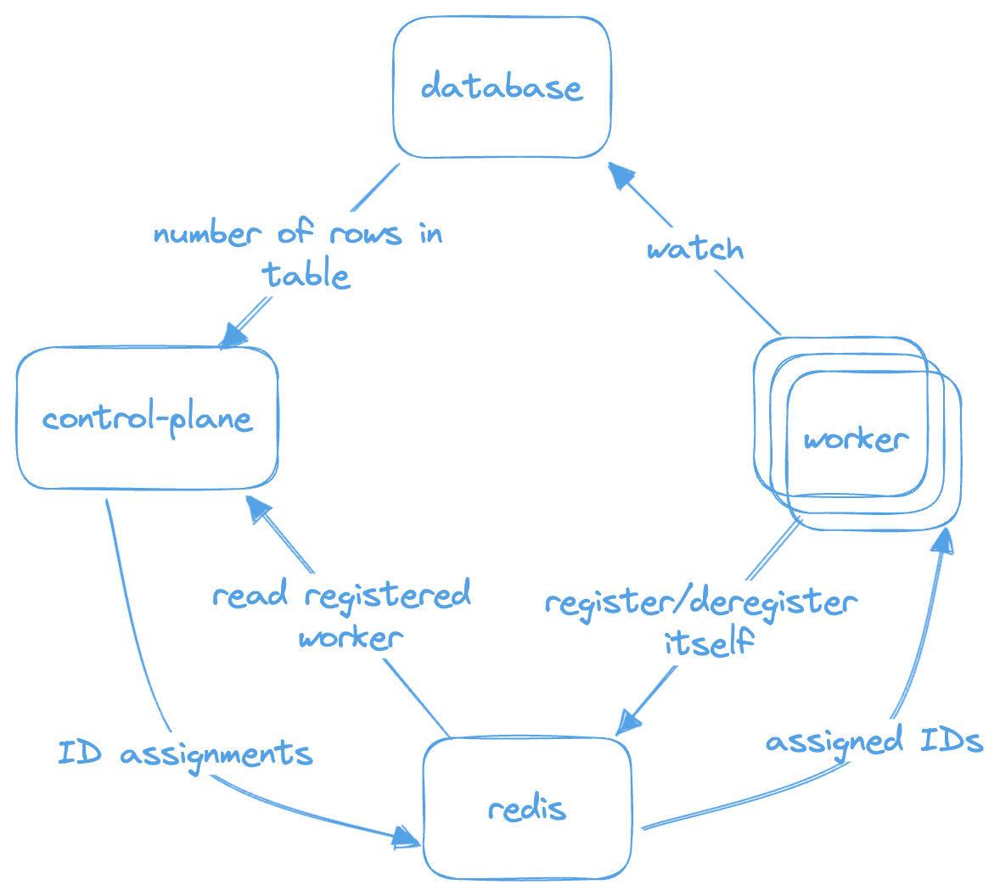

# Notifi-Scaler

## **Overview**

The **`notifi-scaler`** project is a Kubernetes-based system designed to horizontally scale works among workers based on the number of values in a table. The project includes Kubernetes manifests to deploy a control plane, workers, and database components. The workers process subsets of the table, incrementing a **`Value`** column and updating the **`CurrentWorker`** column as they go along.

The primary objective is to balance the workload across multiple worker nodes and to adapt to changes in the table or the number of workers dynamically. To achieve that, a consistent hashing algorithm in implemented.

## System Requirement

Given a table of values with the schema below, create a system that will horizontally scale up and down workers based on the number of values in the table. When one worker that’s processing the subset of the table is removed, the workload should be distributed evenly across the other workers until a new worker node is added.

Table Schema:

- ID: uuid
- Value: integer
- CurrentWorker: string

While a worker is processing a subset, it should increment the Value by 1 every second, and ensure the CurrentWorker value is set to the worker pod’s name.

Every second, the worker should print the list of ID’s that are being watched in the table. These should be stable if there’s no change to the amount of values in the table, or number of workers available. Upon change to either, there should be a redistribution done, minimizing the amount of change across workers. (hint: consistent hashing)

You can use any database of your choice.

You are not allowed to use the k8s controlplane APIs.

**Acceptance criteria:**

I should be able to helm deploy an app (can be written in golang or any other language of preference) to my kubernetes cluster.

Viewing the logs of the worker nodes should show the output described above.

If I change the deployment size, I should see the logs representing the redistribution.

TTR for disruption/size changes is important.

## Structure

```
➜  notifi-scaler git:(main) ✗ tree
.
├── Chart.yaml
├── README.md
├── images
│   ├── control-plane
│   │   ├── Dockerfile
│   │   └── main.go
│   └── worker
│       ├── Dockerfile
│       └── main.go
├── static
│   └── architecture.png
├── templates
│   ├── control-plane-deployment.yaml
│   ├── control-plane-service.yaml
│   ├── db-configmap.yaml
│   ├── db-pv.yaml
│   ├── db-pvc.yaml
│   ├── db-secret.yaml
│   ├── db-service.yaml
│   ├── db-statefulset.yaml
│   ├── db-storageclass.yaml
│   ├── redis-deployment.yaml
│   ├── redis-service.yaml
│   ├── worker-deployment.yaml
│   └── worker-service.yaml
└── values.yaml
```

## **Requirements**

- Helm v3.x
- Kubernetes v1.27.x



## ****Quick Start****

- Deploy

```bash
git clone https://github.com/yourusername/notifi-scaler.git
cd notifi-scaler
helm install notifi-scaler .
```

- Monitor

```bash

# k8s
while true; do clear; kubectl get pods; sleep 1; done

# control-plane
while true; do kubectl logs $(kubectl get pods -l app=control-plane -o jsonpath='{.items[0].metadata.name}'); sleep 1; done

# all workers
for hash in $(kubectl get pods -l app=worker -o=jsonpath='{.items[*].metadata.labels.pod-template-hash}'); do kubectl logs -l app=worker,pod-template-hash=$hash --all-containers=true; done

# single worker
kubectl logs <worker-pod-name>

# database
while true; do clear; kubectl exec -it postgres-0 -- psql -U user -d mydatabase -c "SELECT * FROM public.work_items ORDER BY currentWorker;"; sleep 1; done

# redis
POD_NAME=$(kubectl get pods -l app=redis -o=jsonpath='{.items[0].metadata.name}' -n default) && while true; do clear; kubectl exec -it "$POD_NAME" -- redis-cli hgetall workers; sleep 1; done
```

- Scale

```bash
helm upgrade notifi-scaler-release . --set worker.replicaCount=<number-of-replicas>
```